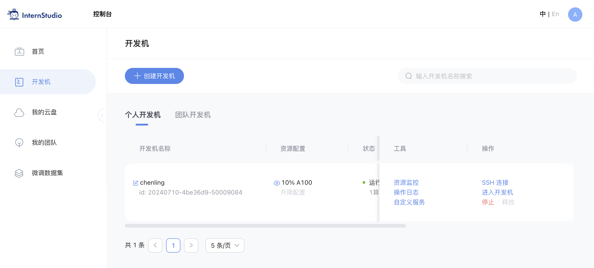
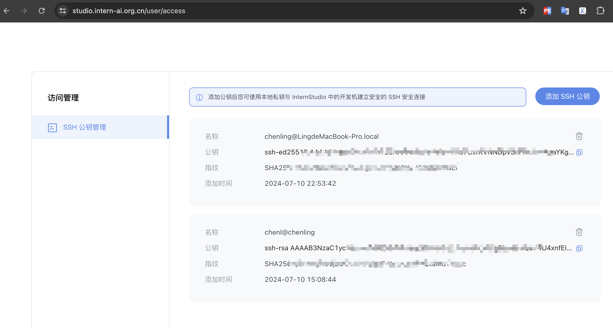
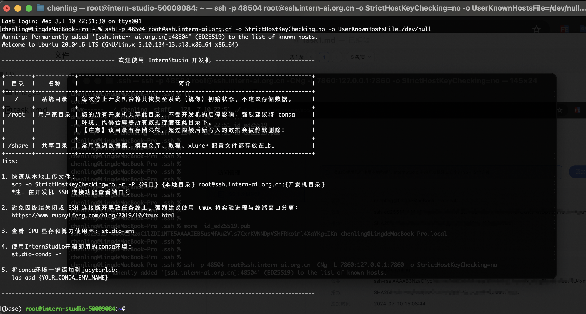
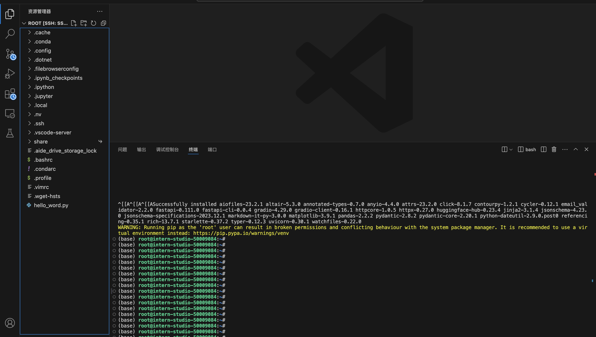
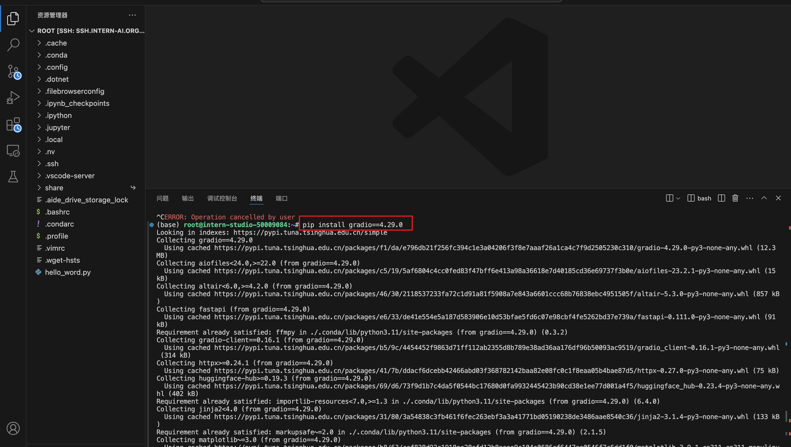
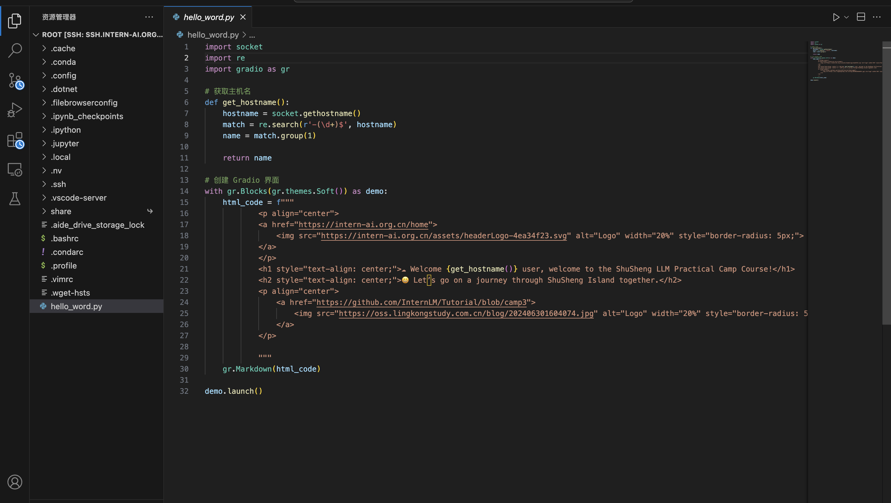
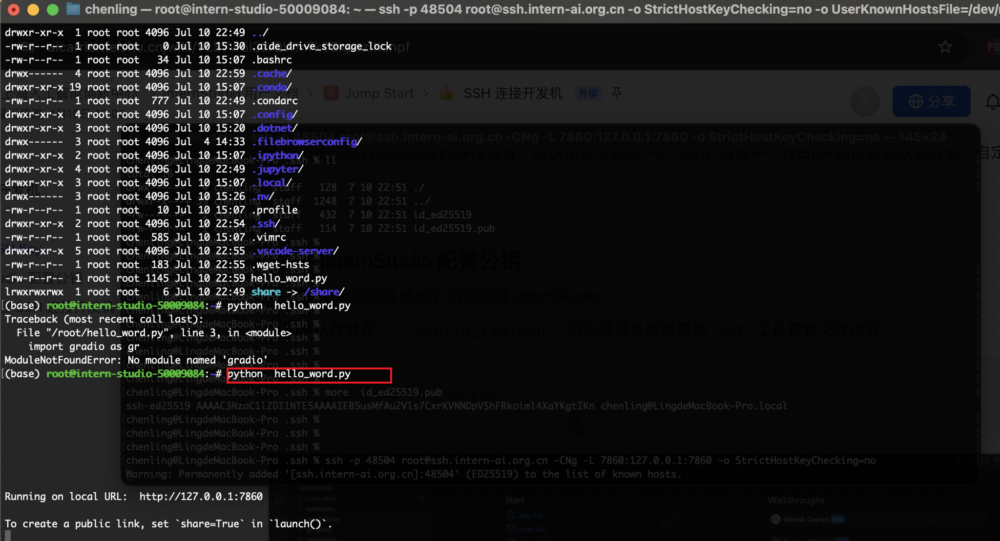
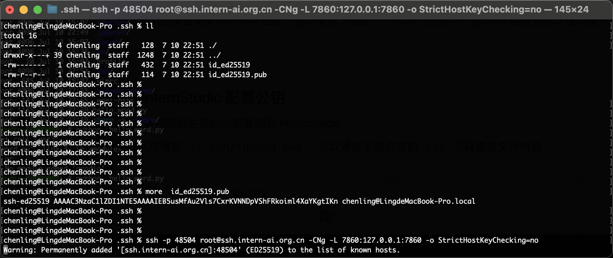
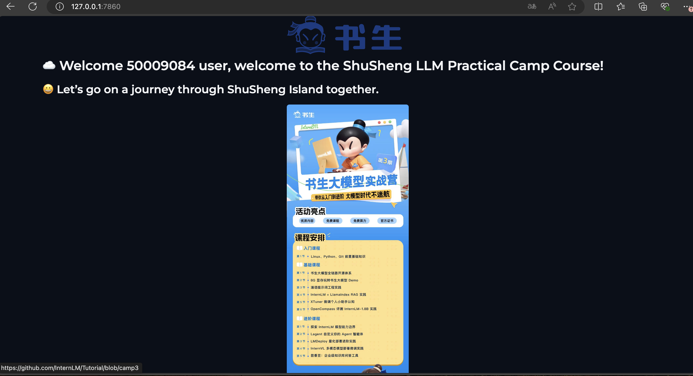

# 书生浦语大模型任务

### 任务

完成SSH连接与端口映射并运行`hello_world.py`

### 任务步骤

1. 创建开发机

   登录 InternStudio,根据教材创建开发机，如下图：

   

2. 配置  ssh  公钥

3.使用 终端 或者 vscode 连接 开发机

4. 安装 gradio 依赖 ，安装过程耗时比较长，需要耐心等待。

   

5.  新建 hello_word.py. 文件，并执行

   

6 .本机端口代理

7.访问本机的7860 端口

