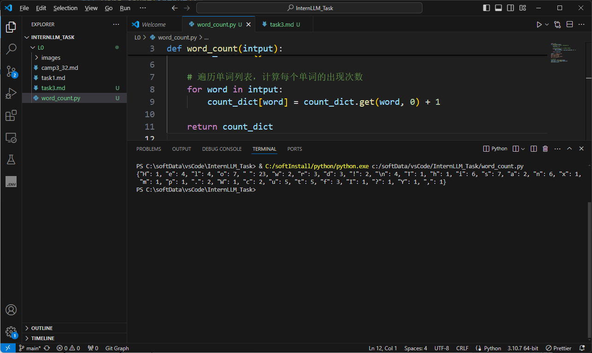
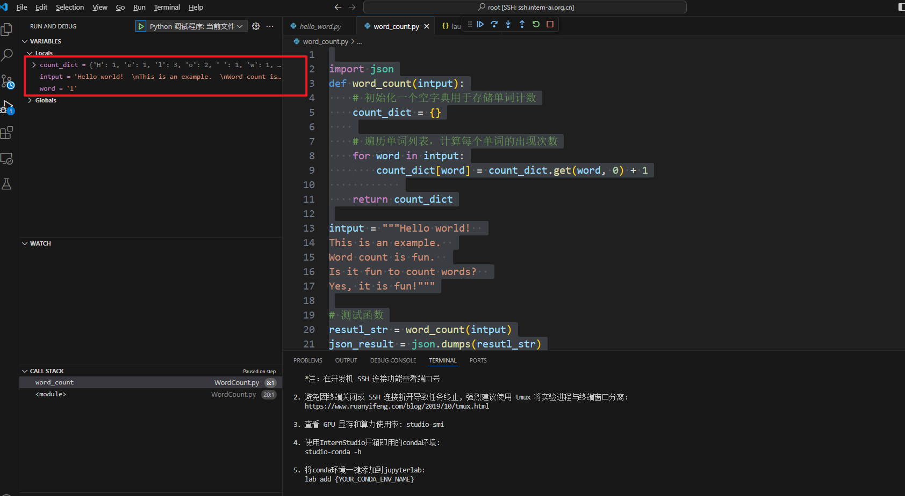

# 任务三： 实现字符数量统计

1. 编写代码

   ```python
   
   import json
   def word_count(intput):
       # 初始化一个空字典用于存储单词计数
       count_dict = {}
       
       # 遍历单词列表，计算每个单词的出现次数
       for word in intput:
           count_dict[word] = count_dict.get(word, 0) + 1
               
       return count_dict
   
   intput = """Hello world!  
   This is an example.  
   Word count is fun.  
   Is it fun to count words?  
   Yes, it is fun!"""
   
   # 测试函数
   resutl_str = word_count(intput)
   json_result = json.dumps(resutl_str)
   print(json_result)
   
   ```

   

2. 运行结果

   

3. debug 示意

